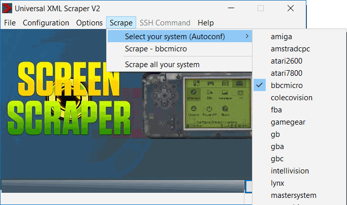

# ROM previews for GMenuNext on RetroGame/RS-97

Please follow this guide to download screenshots for your roms and show them in GMenuNext. If you enable previews in GMenuNext, the plain list of roms is replaced by a split view showing a screenshot or boxart of the selected ROM. The end result could look like this:

  

## 1) Create preview images with Universal XML Scraper

### 1.1) Download Universal XML Scraper and profile

* download [latest release of Universal XML Scraper](https://github.com/Universal-Rom-Tools/Universal-XML-Scraper/releases)
* extract to  folder on your PC (e.g. /UXS)
* download [this sample profile for Universal XML Scraper](uxs-profile-rs-97.zip)
* extract content of profile zip file to /UXS/ProfilsFiles/

### 1.2) Configure Universal XML Scraper

* start UXS and go to `Configuration` > `Change your profile`
  
  

* go to `Configuration` > `General configuration` and edit your country/language preferences and included file extensions

  

* go to `Configuration` > `Advanced` > `Autoconfiguration path configuration`
* change `Root System directory` to the directory that contains your rom folders (e.g. snes/nes/gb etc.)

  

* after hitting `Save`, your rom directories should be found
* verify that `Scrape` > `Select your system` contains all your rom directories

### 1.3) Download preview images for a system

* use `Scrape` > `Select your system` to select a system

  

* click `Scrape` > `Scrape - ...` to start scraping

  

* Universal XML Scraper will now try to find screenshots for your roms
    
  

* wait for the results and verify that most roms were found

  
  
* there should be a folder `previews` in your rom folder now

  

* the file type of the preview images can be changed in the config (jpg/png)

## 2) Enable previews in GMenuNext

### 2.1) Update link settings

* disconnect your device or insert the sd card again
* select the emulator of your choice in GMenu and press `SELECT`
* select `Edit ...` to bring up the link settings for this emulator
* change `Selector Directory` to the directory that contains your rom files
* change `Selector Screenshots` to the preview directory that was created inside the rom folder

### 2.2) Support multiple directories (optional)

* the solution from 2.1 will not work with multiple rom directories per emulator
* to fix this, we need to replace the absolute path for the screenshots by a relative path
* start Glutexto on your device or mount your device to your computer
* open the link file of an enulator from `/gmenu2x/sections/emulators/`
* change the value of `selectorscreens` from `/mnt/.../previews` to `./previews`
* previews are now found in multiple directories per emulator

### 2.3) Profit!

* start the emulator and enjoy small but beautiful preview images for your roms
